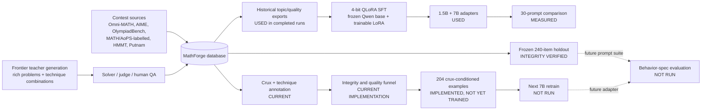

# MathForge Model and Training Architecture — Demonstration Report

**Snapshot:** 2026-07-12  
**Scope:** The architecture actually used for completed training runs, followed by the current retraining blueprint. Historical facts and current code are kept separate because the datasets and safeguards changed after the last trained adapter.

## Executive summary

MathForge does **not** train a language model from scratch. It adapts an existing Qwen instruct model through supervised fine-tuning with 4-bit QLoRA: curate examples, render them with the Qwen chat template, freeze the quantized base, train small LoRA matrices, and load the adapter over the same base for inference.

The data contract has evolved across versions and should not be collapsed into one architecture:

- The completed **1.5B pilot** was conditioned on topic/difficulty/elegance and targeted a problem, full solution, and answer.
- The completed **7B run** was also conditioned on topic/difficulty/elegance; it targeted a problem plus a key idea when a crux annotation existed, otherwise a solution sketch, followed by an answer.
- Only the **current, not-yet-trained creative export** supplies the actual crux and required technique IDs in the model input and targets a problem, key idea, complete solution, and AIME-range answer.

Two completed training runs are evidenced in the project history:

- A first `Qwen2.5-1.5B-Instruct` QLoRA run.
- A later `Qwen2.5-Math-7B-Instruct` QLoRA run, which is the adapter used in the preserved 30-prompt benchmark.

The current repository contains a substantially safer training-data architecture, but there is no evidence that the 7B model has yet been retrained on the current 204-row `train_creative.jsonl` export. The most accurate status is:

> **Historical adapters trained; current integrity-guarded creative dataset and training safeguards implemented; current-data retrain not yet evidenced.**

## Status key

| Label | Meaning |
|---|---|
| **Used** | Evidence shows this was part of a completed training run. |
| **Implemented** | Present in current code/data but not necessarily used by a completed adapter. |
| **Planned** | Described or partially scaffolded without a completed qualifying run. |

## One-slide architecture



The upper branch is the historical path actually used to train the two adapters. The lower branch is the current, stricter architecture. The dotted arrows mark the missing next experiment.

## 1. Behavioral architecture

The current system is designed around one narrow behavior:

> Given a crux insight and, when applicable, required techniques, compose an original, self-contained AIME-style problem with a unique integer answer, a complete valid solution, and no artificial step-stacking.

This is an **inverse-problem-solving** formulation from [SLM Brainlift.md](../SLM%20Brainlift.md): the crux should be the unit of generation, while topic and surface form are secondary controls. That full input contract is implemented only in the current exporter, not in either completed adapter.

| Version | Model input | Assistant target | Status / limitation |
|---|---|---|---|
| 1.5B pilot | Topic, difficulty, problem/solution elegance | Problem, full solution, answer | Used; no crux supplied as input |
| 7B main run | Topic, difficulty, problem elegance, plus a generic request for one deep idea | Problem, annotated key idea when available (otherwise a short solution sketch), answer | Used; crux appeared as an output target, not a control input |
| Current creative blueprint | Actual seed crux, required technique IDs, topic, difficulty | Problem, key idea, complete solution, normalized integer answer | Implemented; not yet used in a completed run |

The 1.5B data also had a material contract mismatch. Its prompt demanded an integer answer in `[0, 999]`, but after the elegance filter its 2,221 examples contained only 588 in-range integer targets; 1,435 were symbolic, 190 were out-of-range integers, and 8 had no answer. The supervision therefore did not consistently support the stated AIME-only format.

## 2. What was actually trained

### Training-run timeline

| Version | Completion status | Base model | Historical dataset snapshot | Role in current evidence |
|---|---|---|---|---|
| 1.5B pilot | Used; completed after resume | `Qwen/Qwen2.5-1.5B-Instruct` | `train.jsonl`: 4,673 rows before filter; 2,221 after `problem_elegance >= 3.5`; 2,154 train / 67 internal eval | First end-to-end QLoRA proof; its 5-prompt result artifacts conflict and are not headline evidence |
| 7B main run | Used; completed | `Qwen/Qwen2.5-Math-7B-Instruct` | Historical `train_elegant.jsonl`: 3,733 weighted rows representing 1,230 unique IDs; 3,621 row-level train / 112 internal eval | Adapter loaded successfully by the 30-prompt base-vs-tuned benchmark |
| Current creative retrain | Implemented blueprint; not evidenced as trained | `Qwen/Qwen2.5-Math-7B-Instruct` | Current `train_creative.jsonl`: 204 unique rows | Integrity-audited next-run dataset |

The historical counts come from the archived Claude Code training conversation and run output. The filenames now point to rebuilt exports:

- Current `train.jsonl` has 2,955 rows, not the historical 4,673.
- Current `train_elegant.jsonl` has 165 unique rows, not the historical 3,733 weighted rows.
- Candidate historical files are retrievable from Git: `data/train.jsonl` at commit `4d18552` and `data/train_elegant.jsonl` at commit `4e85351`.

What is missing is a run ledger or recorded hash proving that those exact committed bytes were the files uploaded for each adapter. The likely snapshots are recoverable; the binding from snapshot to training run is not independently verifiable.

### QLoRA configurations used

| Setting | 1.5B pilot | 7B main run |
|---|---:|---:|
| Base | Qwen2.5-1.5B-Instruct | Qwen2.5-Math-7B-Instruct |
| Adaptation | 4-bit QLoRA | 4-bit QLoRA |
| Quantization | NF4, double quantization | NF4, double quantization |
| Compute dtype | bfloat16 | bfloat16 |
| LoRA rank `r` | 16 | 32 |
| LoRA alpha | 32 | 64 |
| LoRA dropout | 0.05 | 0.05 |
| Target modules | Attention + MLP projections | `q`, `k`, `v`, `o`, `gate`, `up`, `down` projections |
| Max sequence length | 2,048 | 1,536 |
| Device batch | 1 | 1 |
| Gradient accumulation | 8 | 8 |
| Effective examples per optimizer step | 8 | 8 |
| Epochs | 3 | 3 |
| Learning rate | `2e-4` | `2e-4` |
| Schedule | Cosine, 5% warmup | Cosine, 5% warmup |
| Packing | No | No |
| Gradient checkpointing | Yes | Yes |
| Save/evaluate cadence | 50 steps | 50 steps |
| Best checkpoint criterion | Configured: internal eval loss | Configured: internal eval loss |
| Seed | 42 in the training configuration | 42 |
| Compute | Colab T4-class run | Configured/recommended for A100 or L4; exact GPU not preserved |
| Saved location | `/content/drive/MyDrive/mathforge-qlora/` | `/content/drive/MyDrive/mathforge-qlora-7b/` |

The 1.5B job was interrupted near step 701 of approximately 810 and resumed from checkpoint 700. The 7B job completed and its adapter was subsequently loaded in the benchmark code. This evidences a successful same-run resume and adapter availability, not model quality or general resume safety.

### What QLoRA means here

The base model weights are loaded in 4-bit NF4 form and remain frozen. Training updates only low-rank matrices inserted into the attention and feed-forward projection layers. At inference time, the adapter is loaded with PEFT on top of the original base.

This design has three practical advantages:

- It fits a 7B math model on a single cloud GPU.
- The learned artifact is much smaller than a full model checkpoint.
- The same base weights can be compared with the adapter enabled or disabled. With paired random seeds, this architecture can support a tightly controlled adapter ablation.

It is supervised behavior adaptation, not pretraining, reinforcement learning, retrieval-augmented generation, or a new model architecture.

### Software stack used

| Layer | Implementation |
|---|---|
| Model/tokenizer | Hugging Face Transformers (`AutoModelForCausalLM`, `AutoTokenizer`) |
| Quantization | bitsandbytes through `BitsAndBytesConfig` |
| Adapter | PEFT `LoraConfig` / `PeftModel` |
| Supervised trainer | TRL `SFTTrainer` / `SFTConfig` |
| Data loading and split | Hugging Face Datasets |
| Compute | PyTorch CUDA with bf16 compute |
| Example formatting | The Qwen tokenizer’s chat template; one rendered conversation in the trainer’s `text` field |
| Experiment logging | Console only (`report_to="none"`); checkpoints on Google Drive |

The trained SLM does not call the frontier teacher, solver, or judge at inference time. Those models belong to the external data-generation and evaluation system.

The training environment is not yet reproducible from the project lockfile. PyTorch, Transformers, TRL, PEFT, bitsandbytes, and Accelerate are absent from `pyproject.toml`/`uv.lock`; the notebooks install broad unpinned versions. The archived run history includes a TRL API incompatibility, so a future run should pin and record the complete GPU-training environment.

## 3. Historical data architecture and the integrity correction

### Historical 7B export

The 7B adapter was trained on a historical elegance-and-difficulty-weighted export. Its design:

- Filter for stronger/elegant problems.
- Build a topic/difficulty/elegance request.
- Target the problem statement and its key idea or short solution sketch.
- Give higher-priority examples more loss influence by physically copying them up to several times.

The historical exporter can be inspected with `git show 4e85351:scripts/export_weighted.py`. It expanded each example with `weighted.extend([row] * copies)`, shuffled the resulting rows, and the training code then applied a random 3% split.

That creates a methodological limitation: identical copies of one problem could appear in both the training and internal-eval subsets. The historical internal `eval_loss` is therefore not a trustworthy held-out problem-level estimate. It was useful as a training monitor, but it should not be presented as generalization evidence.

### Current correction

The present architecture fixes this in two places:

1. Exporters write one row per problem and store quality as `meta.sample_weight` rather than duplicating examples.
2. [scripts/train_qlora.py](../scripts/train_qlora.py) rejects missing/duplicate IDs and splits unique problem IDs before chat formatting (`scripts/train_qlora.py:90-110`).

This removes physical-copy leakage between the internal training and eval partitions.

There is one unresolved implementation gap: `sample_weight` is recorded but neither the sampler nor the loss in `scripts/train_qlora.py` reads it. Today, those weights are descriptive metadata; they do **not** change gradient contribution. A weighted sampler or weighted loss must be implemented and tested before claiming quality-weighted training under the current code.

## 4. Current data pipeline

### Source and storage layer

The database stores problems, solutions, evaluations, provenance, split/frozen state, verification state, and review status. Data sources currently represented in the larger project include Omni-MATH, AIME, OlympiadBench, MATH/AoPS-labelled material, HMMT-derived material, Putnam, and synthetic teacher generations.

The 240 held-out rows are isolated as EVAL/frozen. Training selection uses TRAIN/non-frozen rows and the exporters add exact/canonical/manual quarantine checks.

### Crux and technique layer

For each eligible problem, the pipeline selects a preferred solution and extracts:

- The key crux insight.
- Technique IDs from the taxonomy.
- Topic and target difficulty.
- Elegance, creativity, and interestingness signals where available.
- A normalized AIME integer answer.

The current exporter then constructs the user request explicitly around the crux:

```text
Compose one original, self-contained AIME-style competition math problem
built around the supplied crux.
The answer must be a unique integer from 0 to 999.
Seed crux: ...
Required techniques: ...
```

The assistant target contains:

```text
Problem: ...
Key idea: ...
Solution: ...
Answer: ...
```

This is an important **input-side** alignment: the intended control variable is present in the model input rather than hidden only in metadata. V2 combination rows set `prefer_generator_solution` so the technique-audited generator proof remains the training target. Legacy V1 combination rows do not have the same guarantee and should receive a technique-consistency check before a larger retrain.

### Synthetic and combination-generator layer

The rich-problem and technique-combination programs are **teacher-side data generation**, not part of the trained SLM at inference time. Their purpose is to produce higher-creativity candidates for later SFT.

The export gate requires synthetic rows to be stored as verified and human accepted. The combination workflow tracks separate solver and judge calls, required techniques, crux, faithfulness, QA, and provenance.

Current limitation: the historical combination batch mostly used Claude Opus 4.8 as generator, solver, and judge. The V2 canary improved separation with three Sonnet 4.6 solver attempts and an Opus judge, but all roles remain within the Claude family, so human verification remains essential.

The combination-generator V2 code is implemented. Its first stored canary (`distill-combo-00ffb6d49c3c`) passed three Sonnet solver attempts plus Opus well-posedness review, was human accepted, and is now included in the creative export. The export contains eight legacy bridge-V1 combination rows and one V2 row.

### Current creative export snapshot

The current [data/train_creative.jsonl](../data/train_creative.jsonl) contains:

| Property | Value |
|---|---:|
| Rows | 204 |
| Unique problem IDs | 204 |
| AIME-range integer answers | 204 |
| Mean difficulty | 6.14 |
| Mean problem elegance | 3.78 |
| Mean stored sample weight | 3.81 |

Source mix:

| Source tag | Rows |
|---|---:|
| Omni-MATH | 128 |
| OlympiadBench | 37 |
| MATH | 30 |
| Combination-generated (8 bridge V1 + 1 V2) | 9 |

Automated exact/canonical/manual checks pass. Twelve reviewed semantic pairs are now durable explicit-keeper groups in the quarantine manifest, so only the stronger representative enters an export. The chosen OlympiadBench proofs are also unwrapped from their imported list serialization before training. The gate is still review-driven rather than a general semantic detector.

## 5. Current training blueprint

The active [scripts/train_qlora.py](../scripts/train_qlora.py) defaults to:

| Parameter | Current default |
|---|---|
| Base | `Qwen/Qwen2.5-Math-7B-Instruct` |
| Data | `data/train_creative.jsonl` |
| Quantization | 4-bit NF4, double quantization, bf16 compute |
| LoRA | `r=32`, `alpha=64`, dropout `0.05` |
| Target modules | `q_proj`, `k_proj`, `v_proj`, `o_proj`, `gate_proj`, `up_proj`, `down_proj` |
| Max length | 1,536 |
| Epochs | 3 |
| Learning rate | `2e-4` |
| Batch | 1 × 8 gradient accumulation |
| Internal split | 3%, seed 42, unique IDs split before formatting |
| Scheduler | Cosine with 5% warmup |
| Default output path | `mathforge-qlora` |
| Checkpointing | Every 50 steps; retain 3; auto-resume latest checkpoint found in `OUT` |
| Selection | Configured to load the best adapter by internal eval loss |

This is a coherent continuation of the historical 7B architecture with improved integrity guards. It should be called the **next-run configuration**, not the architecture of an already measured current-data adapter.

Auto-resume currently trusts the output directory without validating the base model, LoRA rank, dataset, or training configuration. Reusing a 1.5B checkpoint directory for a 7B run previously caused a shape-mismatch failure. Every new experiment should therefore use a fresh run-specific `OUT` directory, and resume should eventually validate a persisted compatibility manifest before loading a checkpoint.

With only 204 rows, this configuration is also a small-data experiment. The next run should record the exact dataset hash, effective step count, train/eval losses, chosen checkpoint, package versions, GPU, elapsed time, and final adapter hash. None of those complete run artifacts currently exist locally for the current-data blueprint.

## 6. Inference and evaluation architecture

The 7B benchmark loads the quantized Qwen base once, attaches the PEFT adapter, and generates matched pairs by toggling the adapter:

- Adapter enabled → tuned SLM output.
- Adapter disabled → base-model output from the same weights and prompt.

This controls model family, underlying weights, tokenizer, quantization, prompt, and decoding hyperparameters. It does **not** control sampling noise in the preserved run: generation used `do_sample=True`, no fixed per-example seed, and produced adapter/base outputs sequentially. Saved paired seeds or repeated seeds are needed for a tightly controlled comparison.

The preserved 30-prompt result is nevertheless diagnostic:

| Result | Tuned | Base |
|---|---:|---:|
| Well-posed rate | 0.07 | 0.10 |
| Problem elegance | 0.82 | 0.65 |
| Difficulty | 2.75 | 1.83 |
| Pairwise | 12 wins | 13 wins |

There were 5 ties. Tuned outputs received higher judged difficulty and elegance means in this run, but there was no well-posedness or pairwise win. See [eval_suite_demonstration_report.md](eval_suite_demonstration_report.md) for the complete interpretation and limitations.

The 3% internal split created by the training script is only an internal loss monitor. It is separate from:

- the 240-item frozen corpus;
- the 30-prompt generation benchmark;
- teacher-candidate solver/judge QA.

Those layers should not be conflated in a demonstration.

## 7. Used, implemented, and not yet used

| Technique / component | Status | Notes |
|---|---|---|
| Supervised fine-tuning | Used | Both completed adapters |
| 4-bit QLoRA | Used | NF4 + double quantization |
| LoRA on attention and MLP projections | Used | Rank 16 for 1.5B; rank 32 for 7B |
| Gradient checkpointing | Used | Memory reduction on single GPU |
| Checkpoint resume | Used with caveat | Demonstrated within the 1.5B run; current code lacks cross-run compatibility validation |
| Crux/key-idea target formatting | Used in 7B run | Crux was an assistant target when available, not a supplied control input |
| Actual crux + technique IDs as input | Implemented, not trained | Present only in the current creative export |
| Current unique-ID split guard | Implemented | Added after historical training |
| Current verified/human-accepted synthetic gate | Implemented | Export-time rule |
| Combination bridge V1 data | Implemented, not trained | 8 rows in the current export |
| Technique-combination V2 generator | Implemented upstream | First verified/human-accepted canary is in the current export |
| `sample_weight`-aware optimization | **Not implemented** | Metadata exists; trainer ignores it |
| Frozen-240 model benchmark | **Not run** | Holdout currently supports integrity, not a preserved generator result |
| Weak/strong behavioral solver panel | Scaffolded, not populated | No stored panel/attempt evidence in the audited database snapshot |
| DPO / preference tuning | Not used | Assignment stretch goal only |
| Adversarial training/evaluation | Not used | Planned |
| Full-parameter fine-tuning | Not used | QLoRA adapters only |
| Reinforcement learning | Not used | No PPO/GRPO/RL stage |

## 8. Architecture strengths

1. **The current input contract operationalizes the thesis.** It contains the actual crux and technique IDs, although combination-target selection still needs a technique-consistency check.
2. **Parameter-efficient adaptation is appropriate.** QLoRA makes repeatable single-GPU iterations feasible.
3. **The same-base adapter toggle can support a clean ablation.** It isolates the adapter more directly than comparing unrelated models when random seeds are paired.
4. **Holdout isolation is structural.** TRAIN/non-frozen selection and export overlap checks reduce leakage risk.
5. **Synthetic data must cross multiple gates.** Verification and human acceptance are persisted rather than assumed.
6. **The architecture evolved in response to evidence.** Physical oversampling leakage was removed; unique IDs are now checked before splitting.

## 9. Current gaps and risks

### Reproducibility

- Candidate historical dataset snapshots are available in Git, but no run ledger/hash proves which uploaded bytes trained each adapter.
- Local adapter weights, `trainer_state.json`, package lock snapshot, and loss curves are absent.
- Notebook execution counts/outputs do not provide a durable training ledger.
- GPU-training dependencies are broad and unpinned rather than captured in the project lockfile.
- Auto-resume does not validate checkpoint compatibility with the requested run.

### Data integrity

- The 12 known semantic duplicate pairs are resolved, but discovery of new semantic paraphrases remains review-driven.
- The current 204-row export is small and source-heavy toward Omni-MATH.
- Current `sample_weight` values do not affect training.
- Combination prompts can demand techniques that the selected assistant solution does not explicitly demonstrate.

### Verification independence

- Much of the synthetic generation, solving, and judging used the same Claude model family.
- Human-label calibration is not yet large enough to substantiate a calibrated-judge claim.

### Behavior coverage

- The last measured 7B adapter was not trained on the current integrity-guarded export.
- The measured benchmark did not directly test held-out crux faithfulness, required-technique loading, novelty, integer-answer adherence, or step-stacking.
- Validity remains the dominant observed failure.

### Model-size scope

The assignment suggests Qwen3 models up to 4B, and the Brainlift’s buildability premise cites a model at or below 4B. The 1.5B pilot is the assignment-scale demonstration; the 7B model is a larger experimental follow-up. Unless that departure has been explicitly approved, it should be disclosed rather than presented as the original small-model target.

### Model claim

- The current evidence does not show that the SLM beats its base, much less a strong general model.
- The defensible claim today is that the architecture can train and evaluate a narrow adapter, and the first result identified exactly which data behavior must improve.

## 10. Recommended next architecture iteration

### Before retraining

1. **Completed:** quarantine the 12 reviewed semantic duplicate pairs and rebuild all exports.
2. Add a technique-consistency check for the eight legacy V1 combination targets; V2 already preserves its audited generator proof.
3. Freeze a named dataset release, for example `train_creative_v2.jsonl`, and record its SHA-256 hash and row-level provenance manifest.
4. Decide whether quality weighting is required:
   - implement and test a weighted sampler/loss; or
   - remove the unused `sample_weight` claim and train uniformly.
5. Pin the CUDA training stack and create a fresh run-specific output directory with a compatibility manifest.
6. Freeze a versioned behavior-evaluation prompt manifest before training.

### Controlled training experiment

Train one new adapter with the current QLoRA recipe, then preserve:

- base model revision and tokenizer revision;
- code commit and dirty-diff patch;
- dataset and eval-manifest hashes;
- all environment variables and random seeds;
- package versions and GPU type;
- step-level train/eval loss and selected checkpoint;
- adapter configuration, size, and final hash.

Never point the new run at an output directory containing a different base model or LoRA configuration.

If compute allows, add the most informative ablation from the Brainlift:

- same examples and SFT budget;
- one model conditioned on topic only;
- one model conditioned on the extracted crux;
- compare valid-and-faithful generation on the same held-out crux prompts.

That experiment directly tests whether insight conditioning—not merely QLoRA or style imitation—creates the desired behavior.

### Evaluation after training

Run base and tuned models on identical versioned prompts with multiple saved seeds. Make “well-posed + independently solved + unique correct integer answer” the first hard gate. Only then score crux faithfulness, anti-step-stacking, difficulty, elegance, and novelty.

The immediate goal should be a statistically credible base-model improvement on behavior-spec adherence. A strong-general-model comparison is a later benchmark once the SLM reliably clears its own validity gate.

## 11. Demonstration talk track

A concise architecture explanation for a live demo:

1. “The model is a Qwen base plus a small trained LoRA adapter; it was not trained from scratch.”
2. “The 1.5B assignment-scale pilot learned from topic/quality prompts and full-solution targets; its data contradicted the integer-only request.”
3. “The larger 7B follow-up targeted problem statements and key ideas, but the actual crux still was not supplied as input.”
4. “Its 30-prompt benchmark gave higher judged difficulty/elegance means, but a 12–13–5 statistical dead heat and only 7% well-posedness.”
5. “We then rebuilt the data layer around the real thesis: one ID per row, frozen holdout, accepted synthetic QA, and the actual crux/techniques in the prompt.”
6. “That integrity-audited 204-row creative dataset is the next retraining input; it has not yet produced the reported benchmark numbers.”

This tells a strong engineering story without claiming a result that has not been measured.

## Evidence index

- Behavior thesis: [SLM Brainlift.md](../SLM%20Brainlift.md)
- Assignment specification: [Train Your Own Small Learning Model.pdf](../Train%20Your%20Own%20Small%20Learning%20Model.pdf)
- Current trainer: [scripts/train_qlora.py](../scripts/train_qlora.py)
- Current creative exporter: [scripts/export_creative.py](../scripts/export_creative.py)
- Current weighted exporter: [scripts/export_weighted.py](../scripts/export_weighted.py)
- Historical 1.5B dataset/export snapshot: Git commit `4d18552`
- Historical 7B weighted dataset/export snapshot: Git commit `4e85351`
- Current creative dataset: [data/train_creative.jsonl](../data/train_creative.jsonl)
- Current integrity snapshot: [data/data_integrity_report.json](../data/data_integrity_report.json)
- Frozen holdout: [eval/frozen_eval_v1.json](../eval/frozen_eval_v1.json)
- Training notebooks: [mathforge_qlora_colab.ipynb](../notebooks/mathforge_qlora_colab.ipynb) and [mathforge_qlora_colabV2.ipynb](../notebooks/mathforge_qlora_colabV2.ipynb)
- Project dependency declaration: [pyproject.toml](../pyproject.toml)
- Base-vs-tuned implementation: [notebooks/bench30_blind_cell.txt](../notebooks/bench30_blind_cell.txt)
- Preserved aggregate result: [Results/bench30_results.tex](../Results/bench30_results.tex)
- Historical run evidence: local Claude Code Chat archive `2026-07-08_21-16_hi-i-have-a-history-of-chats-with-cursor-for-this-.json.zip` (not committed to the repository)
